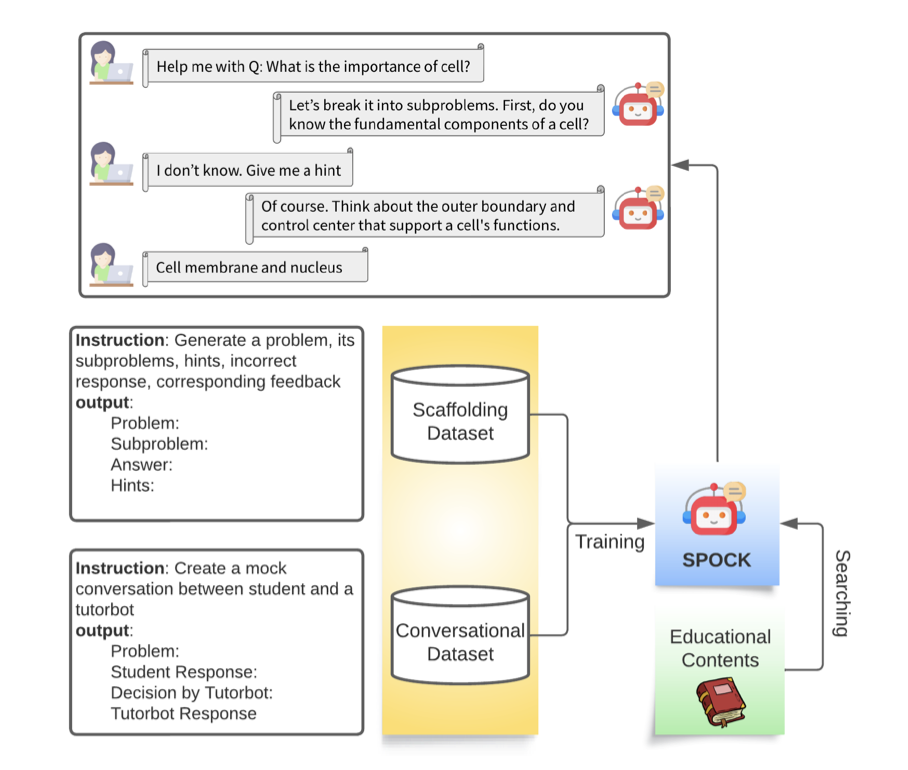
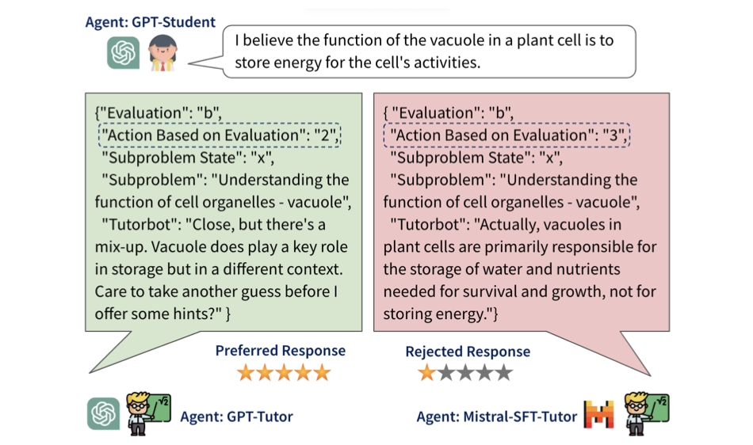

# Tutorbot Spock



> **CLASS: A Design Framework for Building Intelligent Tutoring Systems Based on Learning Science Principles (EMNLP 2023)**\
> Shashank Sonkar, Naiming Liu, Debshila Basu Mallick, Richard G. Baraniuk\
> Paper: https://arxiv.org/abs/2305.13272 \
> Branch: [CLASS](https://github.com/luffycodes/Tutorbot-Spock/tree/CLASS)



> **Pedagogical Alignment of Large Language Models (EMNLP 2024)**\
> Shashank Sonkar*, Kangqi Ni*, Sapana Chaudhary, Richard G. Baraniuk\
> Paper: https://arxiv.org/abs/2402.05000 \
> Branch: [main](https://github.com/luffycodes/Tutorbot-Spock)

## About
This repo aims to develop effective intelligent tutoring agents that help students develop critical thinking and problems solving skills. 

## Installation
- [PyTorch](https://github.com/pytorch/pytorch)
- [Transformers](https://github.com/huggingface/transformers)
- [FastChat](https://github.com/lm-sys/FastChat/)
- [TRL](https://github.com/huggingface/trl)
- [vLLM](https://github.com/vllm-project/vllm)

## Usage
Please refer to `scripts/run.sh` as an example, which runs the training and evaluation of a selected model using 4*A100 GPUs. To run this example without training, download the models from the section below and refer to `scripts/run_no-train.sh`. 
The following subsections break down `scripts/run.sh` with more detailed explanations.

### Datasets
The training and evaluation use bio-dataset-1.json, bio-dataset-2.json, bio-dataset-3.json, and bio-dataset-ppl.json from the datasets folder.
Each contains mock conversations between a student and a tutor based on biology concepts generated from OpenAI's GPT-4. 
These data are then preprocessed into the required formats for training and evaluation datasets.
Please refer to the branch [CLASS](https://github.com/luffycodes/Tutorbot-Spock/tree/CLASS) for instructions on generating these data.

### Configuration
Set the user parameters:
```
FULL_MODEL_PATH="meta-llama/Meta-Llama-3.1-8B-Instruct"
MODEL_DIR="models"
DATA_DIR="datasets"

SFT_OPTION="transformers" # choices: ["transformers", "fastchat"]

ALGO="dpo" # choices: ["dpo", "ipo", "kto"]
BETA=0.1 # choices: [0.0 - 1.0]
```

### Supervised Fine-tuning
Preprocess data:
```
python src/preprocess_sft_data.py --data_dir $DATA_DIR
```

We provide 2 options for SFT: (1) Transformers (2) FastChat.

(1) Run SFT with Transformers:
```
CUDA_VISIBLE_DEVICES=0,1,2,3 torchrun --nproc_per_node=4 --master_port=20001 src/train/train_sft.py \
      --model_path $FULL_MODEL_PATH \
      --train_dataset_path $SFT_DATASET_PATH \
      --eval_dataset_path ${DATA_DIR}/bio-test.json \
      --output_dir $SFT_MODEL_PATH \
      --cache_dir cache \
      --bf16 \
      --num_train_epochs 3 \
      --per_device_train_batch_size 2 \
      --per_device_eval_batch_size 1 \
      --gradient_accumulation_steps 2 \
      --evaluation_strategy "epoch" \
      --eval_accumulation_steps 50 \
      --save_strategy "epoch" \
      --seed 42 \
      --learning_rate 2e-5 \
      --weight_decay 0.05 \
      --warmup_ratio 0.1 \
      --lr_scheduler_type "cosine" \
      --logging_steps 1 \
      --max_seq_length 4096 \
      --gradient_checkpointing
```
(2) Run SFT with FastChat:
```
CUDA_VISIBLE_DEVICES=0,1,2,3 torchrun --nproc_per_node=4 --master_port=20001 FastChat/fastchat/train/train.py \
      --model_name_or_path $FULL_MODEL_PATH \
      --data_path $SFT_DATASET_PATH \
      --eval_data_path ${DATA_DIR}/bio-test.json \
      --output_dir $SFT_MODEL_PATH \
      --cache_dir cache \
      --bf16 True \
      --num_train_epochs 3 \
      --per_device_train_batch_size 2 \
      --per_device_eval_batch_size 1 \
      --gradient_accumulation_steps 2 \
      --evaluation_strategy "epoch" \
      --eval_accumulation_steps 50 \
      --save_strategy "epoch" \
      --seed 42 \
      --learning_rate 2e-5 \
      --weight_decay 0.05 \
      --warmup_ratio 0.1 \
      --lr_scheduler_type "cosine" \
      --logging_steps 1 \
      --tf32 True \
      --model_max_length 4096 \
      --gradient_checkpointing True
```

### Preference Alignment
Generate preference data:
```
CUDA_VISIBLE_DEVICES=0,1,2,3 python src/evaluate/generate_responses.py --model_path $SFT_MODEL_PATH --output_dir ${SFT_MODEL_PATH}/final_checkpoint-dpo --test_dataset_path $DPO_DATASET_PATH --batch_size 256

python src/preprocess/preprocess_dpo_data.py --response_file ${SFT_MODEL_PATH}/final_checkpoint-dpo/responses.csv --data_file $DPO_PREF_DATASET_PATH
```

Run preference alignment:
```
DPO_MODEL_PATH="${MODEL_DIR}_dpo/${MODEL_NAME}_bio-tutor_${ALGO}"

CUDA_VISIBLE_DEVICES=0,1,2,3 accelerate launch --config_file=ds_config/deepspeed_zero3.yaml --num_processes=4 train/train_dpo.py \
    --train_data $DPO_PREF_DATASET_PATH \
    --model_path $SFT_MODEL_PATH \
    --output_dir $DPO_MODEL_PATH \
    --beta $BETA \
    --loss $ALGO \
    --gradient_checkpointing \
    --bf16 \
    --gradient_accumulation_steps 4 \
    --per_device_train_batch_size 2 \
    --num_train_epochs 3
```

### Evaluation
Evaluate the accuracy and F1 scores of SFT and Aligned models:
```
# Generate responses from the SFT model
CUDA_VISIBLE_DEVICES=0,1,2,3 python src/evaluate/generate_responses.py --model_path $SFT_MODEL_PATH --output_dir ${SFT_MODEL_PATH}/final_checkpoint-eval --test_dataset_path $TEST_DATASET_PATH --batch_size 256

# Generate responses from the Aligned model
CUDA_VISIBLE_DEVICES=0,1,2,3 python src/evaluate/generate_responses.py --model_path $DPO_MODEL_PATH --output_dir ${DPO_MODEL_PATH}/final_checkpoint-eval --test_dataset_path $TEST_DATASET_PATH --batch_size 256

# Evaluate the SFT model
echo "Metrics of the SFT Model:"
python src/evaluate/evaluate_responses.py --response_file ${SFT_MODEL_PATH}/final_checkpoint-eval/responses.csv

# Evaluate the Aligned model
echo "Metrics of the RL Model:"
python src/evaluate/evaluate_responses.py --response_file ${DPO_MODEL_PATH}/final_checkpoint-eval/responses.csv
```

Evaluate the ppl of SFT and Aligned models:
```
CUDA_VISIBLE_DEVICES=0,1 python src/evaluate/evaluate_ppl.py --model_path $SFT_MODEL_PATH

CUDA_VISIBLE_DEVICES=0,1 python src/evaluate/evaluate_ppl.py --model_path $DPO_MODEL_PATH
```

## Models
For easier access to the models, download them from Hugging Face.

SFT Models:
- [Llama-3.1-8B-Instruct_bio-tutor_sft](https://huggingface.co/kangqi-ni/Llama-3.1-8B-Instruct_bio-tutor_sft)
- [Mistral-7B-Instruct-v0.2_bio-tutor_sft](https://huggingface.co/kangqi-ni/Mistral-7B-Instruct-v0.2_bio-tutor_sft)
- [zephyr-7b-beta_bio-tutor_sft](https://huggingface.co/kangqi-ni/zephyr-7b-beta_bio-tutor_sft)

Aligned Models:
- [Llama-3.1-8B-Instruct_bio-tutor_dpo](https://huggingface.co/kangqi-ni/Llama-3.1-8B-Instruct_bio-tutor_dpo)
- [Mistral-7B-Instruct-v0.2_bio-tutor_dpo](https://huggingface.co/kangqi-ni/Mistral-7B-Instruct-v0.2_bio-tutor_dpo)
- [zephyr-7b-beta_bio-tutor_dpo](https://huggingface.co/kangqi-ni/zephyr-7b-beta_bio-tutor_dpo)
- [Llama-3.1-8B-Instruct_bio-tutor_kto](https://huggingface.co/kangqi-ni/Llama-3.1-8B-Instruct_bio-tutor_kto)
- [Mistral-7B-Instruct-v0.2_bio-tutor_kto](https://huggingface.co/kangqi-ni/Mistral-7B-Instruct-v0.2_bio-tutor_kto)
- [zephyr-7b-beta_bio-tutor_kto](https://huggingface.co/kangqi-ni/zephyr-7b-beta_bio-tutor_kto)

## Citation
If you find our work useful, please cite:
```
@misc{sonkar2023classdesignframeworkbuilding,
      title={CLASS: A Design Framework for building Intelligent Tutoring Systems based on Learning Science principles}, 
      author={Shashank Sonkar and Naiming Liu and Debshila Basu Mallick and Richard G. Baraniuk},
      year={2023},
      eprint={2305.13272},
      archivePrefix={arXiv},
      primaryClass={cs.CL},
      url={https://arxiv.org/abs/2305.13272}, 
}

@misc{sonkar2024pedagogical,
      title={Pedagogical Alignment of Large Language Models}, 
      author={Shashank Sonkar and Kangqi Ni and Sapana Chaudhary and Richard G. Baraniuk},
      year={2024},
      eprint={2402.05000},
      archivePrefix={arXiv},
      primaryClass={cs.CL},
      url={https://arxiv.org/abs/2402.05000}, 
}
```
